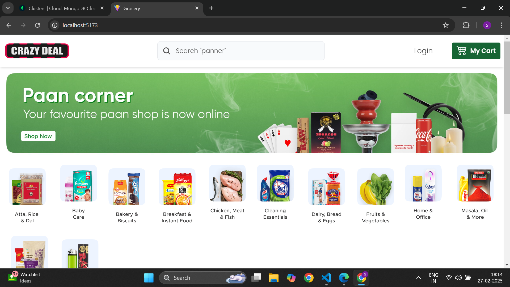
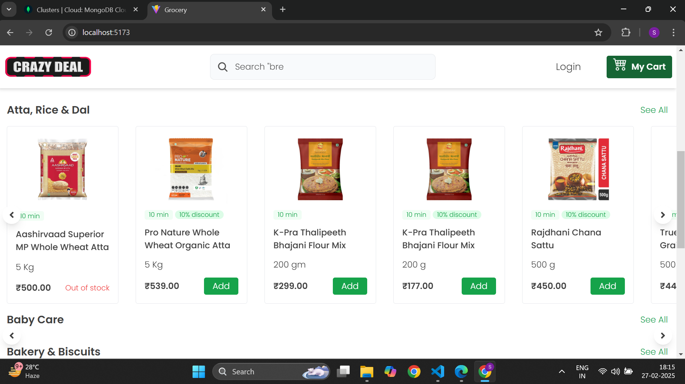
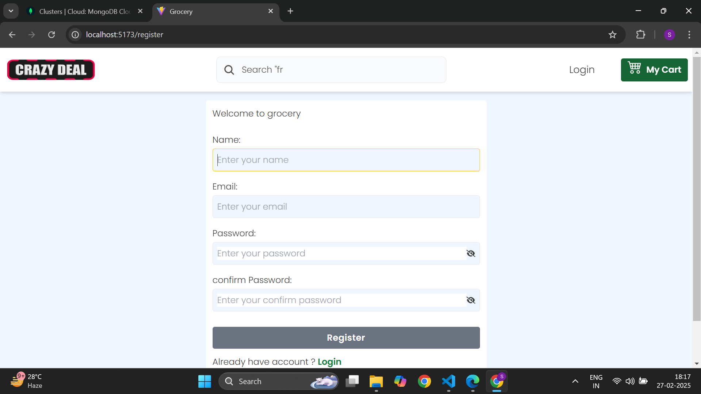
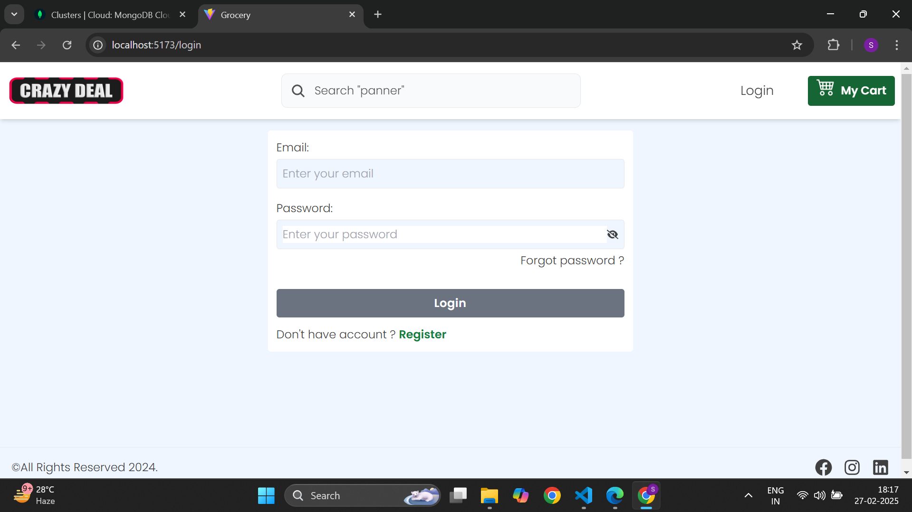

# 🛒 E-Commerce Grocery Application

Welcome to the **E-Commerce Grocery Application** repository! This project is a comprehensive solution for online grocery shopping, built using the MERN stack.

## 🚀 Features

- **User Authentication & Authorization**: Secure login and registration using JWT.
- **Product Management**: Admin interface for adding, updating, and removing products.
- **Shopping Cart**: Add, remove, and modify items in the cart with real-time updates.
- **Order Processing**: Seamless checkout experience with order history tracking.
- **Responsive Design**: Optimized for various devices, ensuring a smooth user experience.

## 🛠️ Technologies Used

### Backend

- 
- 
- 
- 
- 
- 

### Frontend

- 
- 
- 
- 
- 
- 


### create an env file in server

```dotnetcli
FRONTEND_URL=
MONGODB_URI=

RESEND_API=
SECRET_KEY_ACCESS_TOKEN=
SECRET_KEY_REFRESH_TOKEN=
CLODINARY_CLOUD_NAME=
CLODINARY_API_KEY=
CLODINARY_API_SECRET_KEY=
```

### create an env file in client

```dotnetcli
VITE_API_URL=
```

start the server

```bash
npm run dev
```

go to client

```bash
npm run dev
```


## 📸 Screenshots


*Home Page*


*Product Page Without Authentication*


*Register Page*


*Login Page*

## 📦 Installation

1. **Clone the repository**:
   ```bash
   git clone https://github.com/CODESUJON/ecommerce-_grocery-App.git


